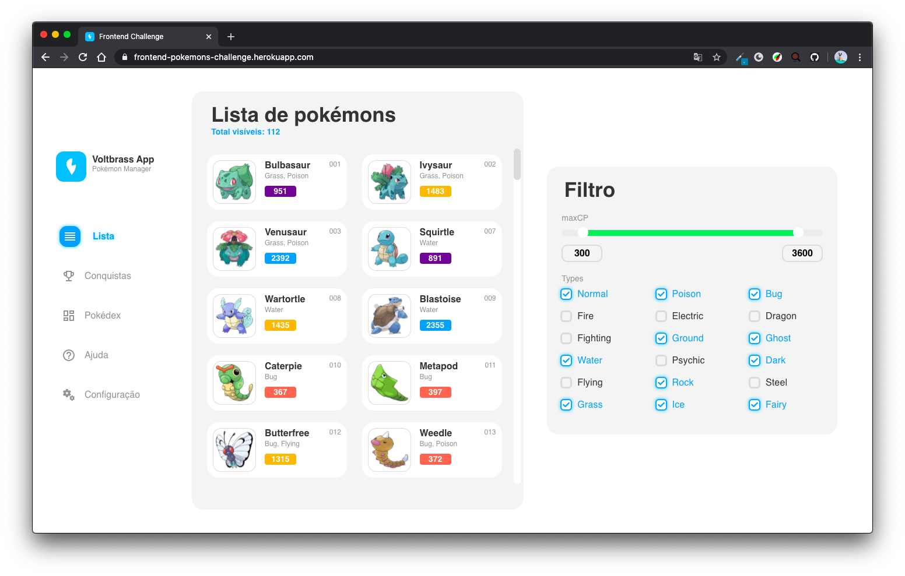

# Frontend Challenge

Este projeto foi desenvolvido para um desafio frontend cujo objetivo era obter os dados de uma [API pública de GraphQL](https://graphql-pokemon.now.sh/) sobre pokemons e implementar uma landing page utilizando React para exibir a lista de pokemons.

Acessar demo no [heroku](https://frontend-pokemons-challenge.herokuapp.com/)

## Tecnologias utilizadas

- React
- Typescript
- Styled Components

## Rodando o projeto

Certifique-se de ter o [Node](https://nodejs.org/en/docs/) instalado e estar usando a versão 12.x

- Execute `npm i`
- Execute `npm start`
- O projeto disponível em http://localhost:3000

## A fazer

- [ ] Implementar testes com Jest
- [ ] Implementar lazy loading
- [ ] Tornar a aplicacão responsiva

## Fonte de dados

A API utilizada esta disponível neste [link](https://graphql-pokemon.now.sh/).
